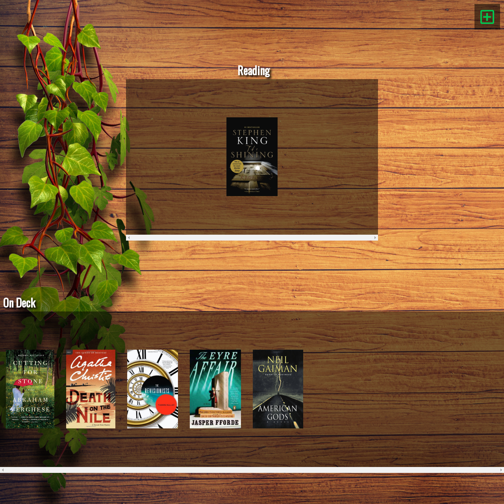
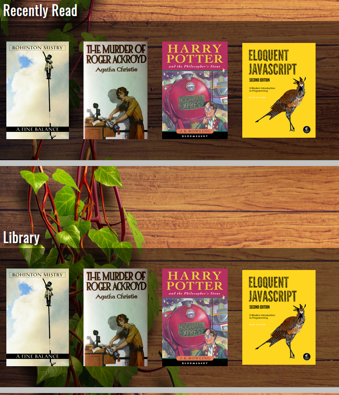
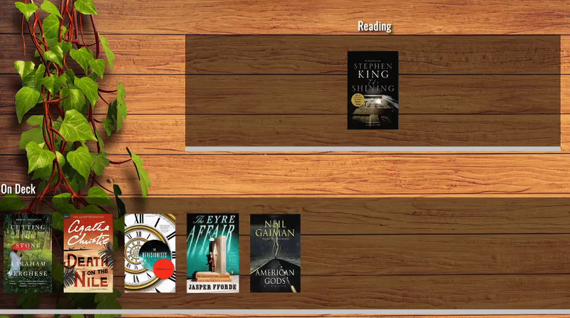
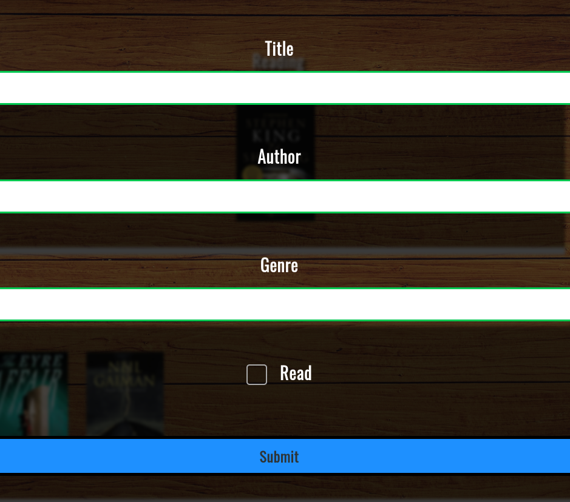

# JavaScript OOP Home Library

> A Library to Organize your Books Online Written for Concordia University

<div align='center'>
  
</div><br>

## Demo

[View the Live Demo](https://andrewbaldwin44.github.io/JavaScript_Home_Library/)

## Features

**_View Details on a Book and Start Reading!_**

<div align='center'>
  
</div><br>

**_Organize Your Books on Different Shelves_**

<div align='center'>
  
</div><br>

**_Drag and Drop your Books onto Different Shelves_**

<div align='center'>
  
</div><br>

**_Add New Books to your Library_**

<div align='center'>
  
</div><br>

## The App

- Data Persistence is present throughout the app. All data will be written to local storage.

## Deploy the project

__Clone the repo to your local machine using the terminal__:
```
$ git clone git@github.com:andrewbaldwin44/JavaScript_Home_Library.git
```

*Then Open the `index.html` Project File in Your Browser*

## Technologies Used

- JavaScript
- HTML
- CSS

## Authors

👤 **Andrew Baldwin**

- Github: [@andrewbaldwin44](https://github.com/andrewbaldwin44)
